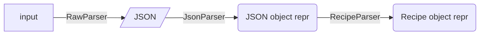
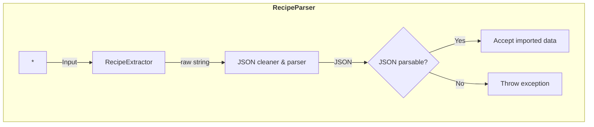
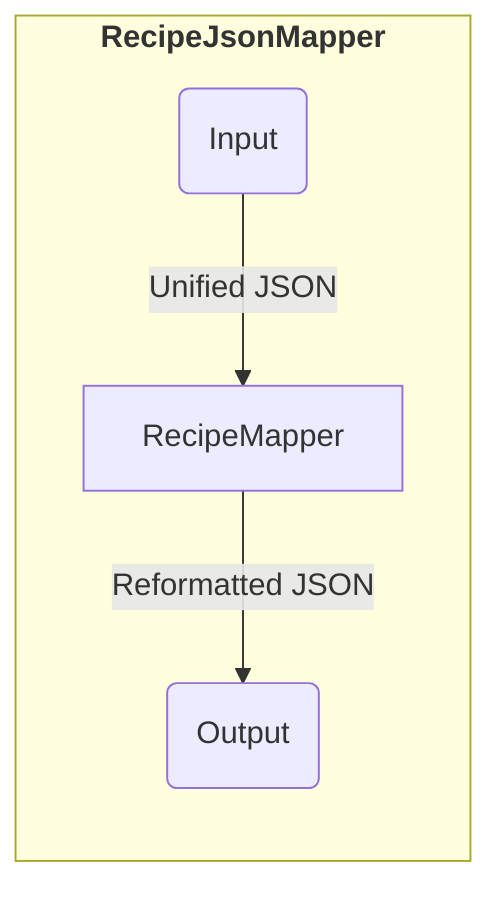
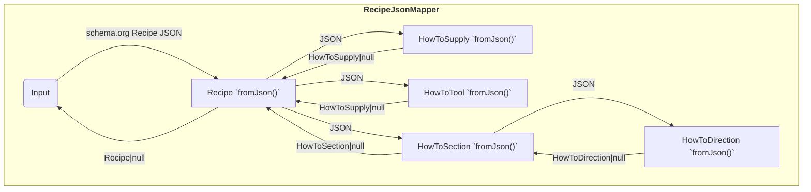

# 🚰 Recipe Import Pipeline

This repository contains a prototype for an import and mapping pipeline for the [🧑‍🍳 Nextcloud Cookbook](https://github.com/nextcloud/cookbook/) app.

The pipeline is planned for importing recipes from multiple input sources (recipe parsers), storing the raw data, extracting recipe data, and mapping it to `Recipe` objects.

## 📋 Status

Currently implemented

- [ ] Base concept for import, should be extensible to support multiple import modules
- [ ] Importing data
- [ ] Testing if imported data contains recipe data
- [ ] Converting imported data to a standardized format for all input sources
- [x] Recipe classes based on `schema.org/Recipe` with a subset of properties for demonstration purposes
- [ ] Mapping JSON to `Recipe`, etc. classes


## 🔀 Flow

The overall process of parsing a recipe is carried out in multiple steps.
The different steps should be described in the following in detail.



During the export the complete parsing chain needs to be carried out.
Nevertheless, in order to make the app extensible with respect to future enhancements, a rather raw version of the initial input data will be stored on disk for persistence.

### Extracting basic JSON data - RawParser

The input of a recipe can be manifold: a URL pointing to a website, a JSON string, HTML code, an image of a cookbook page, a PDF, etc.
The dedicated parser tries to extract the recipe data from the input and creates a valid JSON representation.
For a website this could mean, e.g., looking for and extracting an `ld+json` element.

The goal of the first stage (the `RawParser`) is to create a common data format of raw data.
For simplicity, JSON is used here.
This format must be parsable by the `json_decode` method in PHP.



The extracted (raw) JSON is the value to be stored on the hard drive.

### Mapping to generic Schema.org objects - JsonParser

The representation of JSON objects and arrays in PHP is done using associative and indexed arrays, respectively.
This makes it rather hard to handle complex type structures in plain PHP.
A first step is to translate these generic PHP arrays into a set of structured objects.
These objects are created by classes that represent the basic building blocks of JSON like `JSONObject`, `JSONArray`, `JSONString`, `JSONInteger`, `JSONBool`, and `JSONFloat`.

It might be favorable to define conversion methods in the classes in order to handle bad syntax errors later on in a simpler way.

In order to make the structures as generic as possible, all objects are extracted in a plain graph layout.
That is, the output of the JsonParser is a mapping from unique IDs to `JSONObject`s.
If an object has no ID, a unique ID is temporarily generated.
Each object within another object will be spread out.
That means that the following JSON representation

```json
{
    "@context": "https://schema.org",
    "@type": "Recipe",
    "name": "Baked bananas",
    "author": {
        "@type": "Person",
        "name": "Santa Claus"
    }
}
```

will be flattened out to something like

```json
[
    {
        "@context": "https://schema.org",
        "@type": "Recipe",
        "identifier": 1,
        "name": "Baked bananas",
        "author": {
            "identifier": 2
        }
    },
    {
        "@context": "https://schema.org",
        "@type": "Person",
        "identifier": 2,
        "name": "Santa Claus"
    }
]
```

_Side Note: I am unsure if it is `@identifier`, `identifier`, or something else. Must be adopted accordingly._

In PHP this is represented as an associative array mapping from the identifiers (here `1` and  `2`) to corresponding `JSONObject`s.
By using PHP's magic methods or a common set of getter/setter, all attributes (like `name` or `author`) can be requested.
For the special case of references to objects, it might make sense to define a special class `JSONObjectLink`.

### Mapper

The unified format can be mapped to different formats depending on the requirements. One mapper could output `schema.org` compatible JSON which can be further utilized by the backend or immediately returned.




### Recipe model classes

The `schema.org` recipe objects like `Recipe`, `HowToSupply`, `HowToSection`, `HowToStep`, etc. which are used internally are created from the JSON output of a `RecipeMapper` that maps the unified JSON string to a `schema.org`-compatible JSON string.


