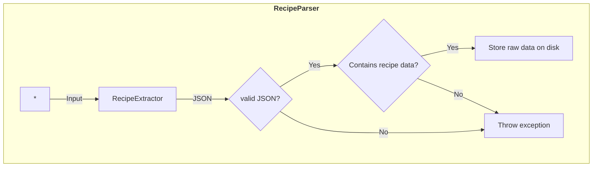

# Recipe Import Pipeline

This repository contains a prototype for an import and mapping pipeline for the [Nextcloud Cookbook](https://github.com/nextcloud/cookbook/) app.

The pipeline is planned for importing recipes from multiple input sources (recipe parsers), storing the raw data, extracting recipe data, and mapping it to `Recipe` objects.

## Status

Currently implemented

- [ ] Base concept for import, should be extensible to support multiple import modules
- [ ] Importing data
- [ ] Testing if imported data contains recipe data
- [ ] Converting imported data to a standardized format for all input sources
- [x] Recipe classes based on `schema.org/Recipe` with a subset of properties for demonstration purposes
- [ ] Mapping JSON to `Recipe`, etc. classes

## Flow

The input of a `RecipeParser` can be manifold: a URL pointing to a website, a JSON string, HTML code, an image of a cookbook page, a PDF, etc. The dedicated parser tries to extract the recipe data from the input and creates a valid JSON string. For a website this could mean, e.g., looking for an `ld+json` element and extracting this. 

