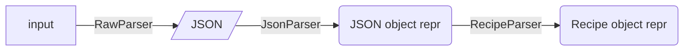
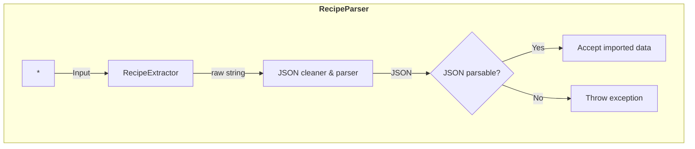
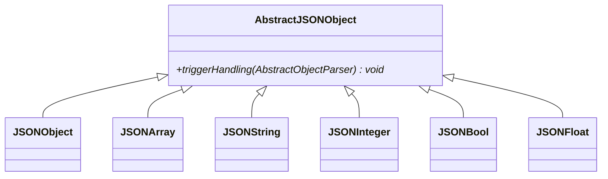
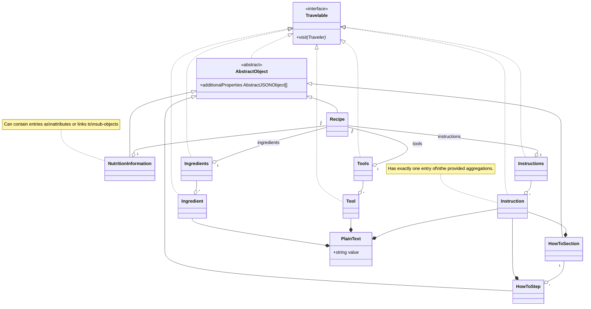
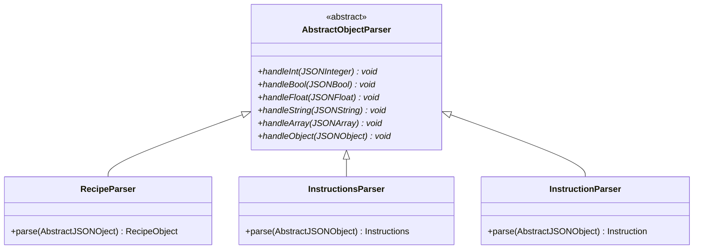
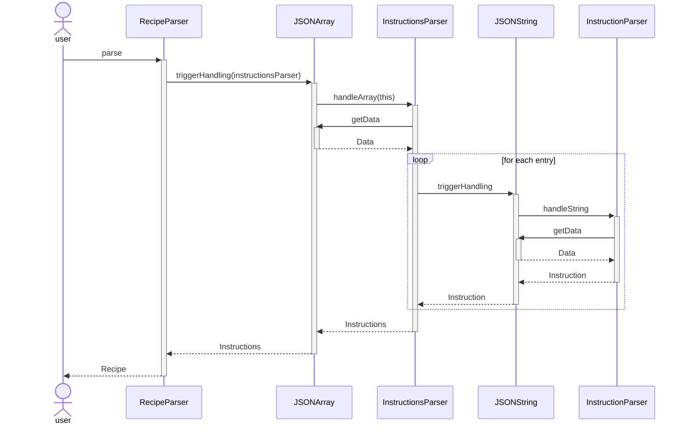
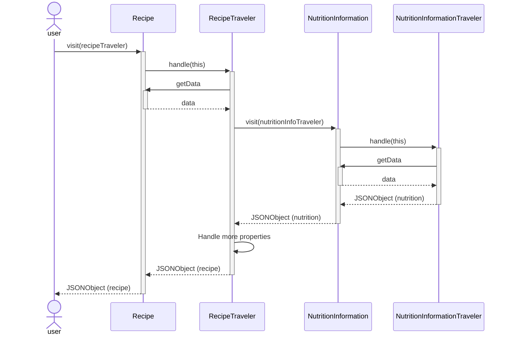
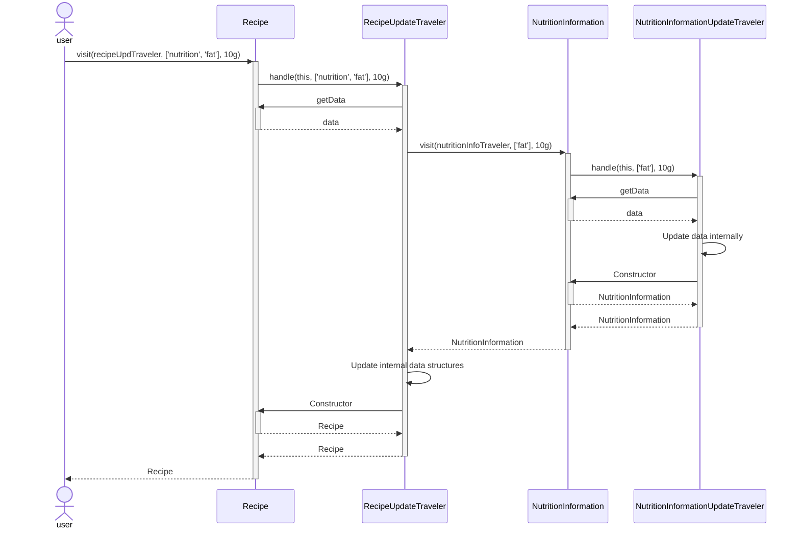

# 🚰 Recipe Import Pipeline

This repository contains a prototype for an import and mapping pipeline for the [🧑‍🍳 Nextcloud Cookbook](https://github.com/nextcloud/cookbook/) app.

The pipeline is planned for importing recipes from multiple input sources (recipe parsers), storing the raw data, extracting recipe data, and mapping it to `Recipe` objects.

## 📋 Status

Currently implemented

- [x] Base concept for import, should be extensible to support multiple import modules
- [ ] Importing data
- [ ] Testing if imported data contains recipe data
- [x] Converting imported data to a standardized format for all input sources
- [x] Recipe classes based on `schema.org/Recipe` with a subset of properties for demonstration purposes
- [x] Mapping JSON to `Recipe`, etc. classes


## 🔀 Flow

The overall process of parsing a recipe is carried out in multiple steps.
The different steps should be described in the following in detail.



During the export the complete parsing chain needs to be carried out.
Nevertheless, in order to make the app extensible with respect to future enhancements, a rather raw version of the initial input data will be stored on disk for persistence.

### Extracting basic JSON data - RawParser

The input of a recipe can be manifold: a URL pointing to a website, a JSON string, HTML code, an image of a cookbook page, a PDF, etc.
The dedicated parser tries to extract the recipe data from the input and creates a valid JSON representation.
For a website this could mean, e.g., looking for and extracting an `ld+json` element.

The goal of the first stage (the `RawParser`) is to create a common data format of raw data.
For simplicity, JSON is used here.
This format must be parsable by the `json_decode` method in PHP.



The extracted (raw) JSON is the value to be stored on the hard drive.

### Mapping to generic Schema.org objects - JsonParser

The representation of JSON objects and arrays in PHP is done using associative and indexed arrays, respectively.
This makes it rather hard to handle complex type structures in plain PHP.
A first step is to translate these generic PHP arrays into a set of structured objects.
These objects are created by classes that represent the basic building blocks of JSON like `JSONObject`, `JSONArray`, `JSONString`, `JSONInteger`, `JSONBool`, and `JSONFloat`.

It might be favorable to define conversion methods in the classes in order to handle bad syntax errors later on in a simpler way.

In order to make the structures as generic as possible, all objects are extracted in a plain graph layout.
That is, the output of the JsonParser is a mapping from unique IDs to `JSONObject`s.
If an object has no ID, a unique ID is temporarily generated.
Each object within another object will be spread out.
That means that the following JSON representation

```json
{
    "@context": "https://schema.org",
    "@type": "Recipe",
    "name": "Baked bananas",
    "author": {
        "@type": "Person",
        "name": "Santa Claus"
    }
}
```

will be flattened out to something like

```json
[
    {
        "@context": "https://schema.org",
        "@type": "Recipe",
        "@id": 1,
        "name": "Baked bananas",
        "author": {
            "@id": 2
        }
    },
    {
        "@context": "https://schema.org",
        "@type": "Person",
        "@id": 2,
        "name": "Santa Claus"
    }
]
```

_Side Note: I am unsure if it is `@identifier`, `identifier`, `@id` or something else. Must be adopted accordingly. [Stackoverflow post `@id`](https://stackoverflow.com/questions/34761970/schema-org-json-ld-reference/34776122#34776122)_

In PHP this is represented as an associative array mapping from the identifiers (here `1` and  `2`) to corresponding `JSONObject`s.
By using PHP's magic methods or a common set of getter/setter, all attributes (like `name` or `author`) can be requested.
For the special case of references to objects, it might make sense to define a special class `JSONObjectLink`.



The goal of this abstraction is to avoid errors by using the IDE features (auto completion) as well as static code analyzers like Psalm.
For the later migration to auto-generated OpenAPIs, the type safety is required.

### Repairing JSON object graph (optional)

In the past it was common that imported sites answered with non-standard object graphs and data structures.
On this level, rather generic checks could be added to make sure, that the object graph to be parsed is uniquely parsable.

Example: One point might be to check _if_ there is a Recipe in the graph and if this is the only one.

This is not to be confused with the checking of the actual recipe structure.
The semantic will be handled later.

### Recipe model classes as data classes

The `schema.org` recipe objects are created as PHP classes like `Recipe`, `HowToSupply`, `HowToSection`, `HowToStep`, etc. which are used internally.
These classes have mainly no functional methods but serve as pure data classes.
The only exception to this non-functionality is the feature to be travelable.

Ideally, these classes would be immutable, so changes to the graph would need new objects to be constructed from scratch.
The actual construction (regardless of mutuality) is done in other classes using the `new` operator.

Here is an example subset of the class hierarchy of the schema.org object classes:



The interface `Travelable` is used later for extraction/updating the graph structure.

**Note:** _This structure is somewhat restricted regarding cyclic dependencies in the graph. Cyclic dependencies cannot be modelled that way. It might be considerable to just store links in the objects (child classes of `AbstractObject`) and handle the pointers outside._

### JSON Object parser - build semantical graph structure

Starting with the [flattened output](#mapping-to-generic-schemaorg-objects---jsonparser), (potentially filtered) an algorithm is needed to extract a semantic tree in form of [semantic objects](#recipe-model-classes-as-data-classes).

For each class in the semantic objects' class tree, a corresponding factory class is defined.
Here is a subset of the parser class tree:



Each parser has a unique parsing method that will create the actual object in question.
In order to build sub-objects (like `Instructions` for a `Recipe`), delegation to the corresponding sub-parser takes place:

The upper level parser takes the corresponding `AbstractJSONObject` and calls the `triggerHandling` method with the corresponding factory object.
Depending on the type ob the `AbstractJSONObject`, one of the `handle*` methods of said factory object is called.
For example, if the instruction entry of the recipe `JSONObject` was an array (aka `JSONArray`), the array's `triggerHandling` will be called which in term calls the `InstructionsParser`'s `handleArray` method.
To make this a bit more clear:



The benefit of this structure is that each `AbstractJSONObject` type needs to be handled explicitly by all `AbstractObjectParser`s.
This allows for static type checking and generation of more useful exception messages.

Once this step has been finished, the complete JSON data can be considered parsed.
Any further handling only involves the output in various formats.

### Graph traversing for output

Once, the recipe data can be expressed as [semantic objects](#recipe-model-classes-as-data-classes), exporting in canonical form can also be done with the observer pattern.
The `Travelable` interface is intended to allow for simple traversing of the complete object tree/graph.

For each `AbstractObject` a corresponding traveler class needs to be defined.
The traveler collects all information of a single `AbstractObject`, including any sub-objects.
The sub-objects might be handled by sibling travelers.
Once the interpretation of one `AbstractObject` is done, the traveler returns an `AbstractJSONObject` representing the `AbstractObject`.

This tree of `AbstractJSONObject` objects can be considered canonical.
One further recursive call allows to extract either plain PHP arrays (to be used with `json_encode`) or as `DataResponse` directly in the NC controller.

The basic idea is sketched in the following image.
However note that there is some extension needed to satisfy all requirementes (see [updating](#graph-traveling-for-update)).



**Note:**
This approach allows to define different sets of traversing classes.
This allows for different out formats (e.g. _legacy_ and _modern_) to later provide a backward compatible output.

### Graph traveling for update

Updating works quite similarly to outputting.
Instead of a `AbstractJSONObject`, the traveler returns an `AbstractObject`.
The original object is to be replaced by the new one.
Note that replacing might not be necessary.
In this case, the original object can be returned.

One issue to solve is however the way to provide the information to the sub-travelers what to change.
Something like "Set the second ingredient of this recipe to `5 tomatoes`".

This involves two parts:

- The actual value `5 tomatoes`
- Some way to address the second ingredient

The latter can be realized by using an array of single addresses like `['ingrdients', 1]` in this case.
Nevertheless, this information needs to be carried over the individual visit steps.



The addressing and the value can be combined in a data class on their own.

**Note:** _There is one question to be handled here though: Should the Traveler be common for reading and writing or different? From the point of statically type checks and simplicity, individual interfaces and separate structures might be preferably. However this might double the amount of code and bloat up the complete structures. This should be thought through one completely before investing too much time in it._

## Storing changes to the recipe

T.B.D.
_This process is crucial to be as minimally invasive during the changes in the files as possible._
